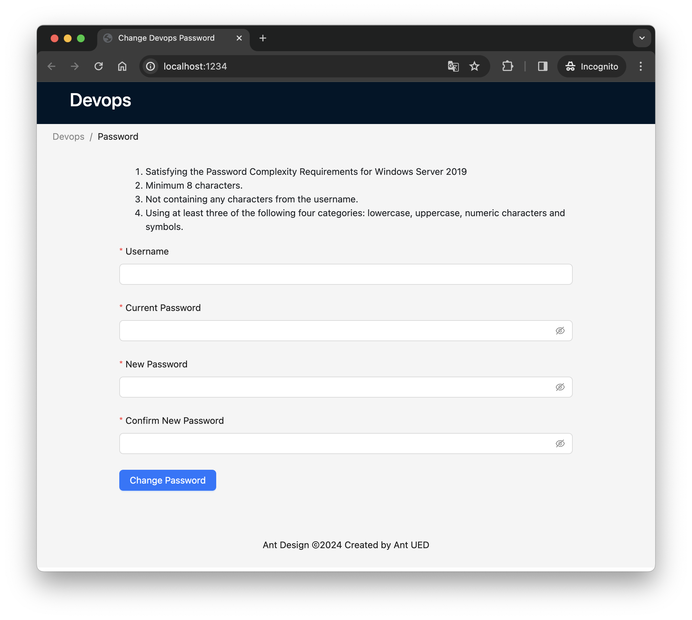

# devops-password-ui

*Web UI for Azure Devops password change form*


  


## Password rules

- Satisfying the Password Complexity Requirements for Windows Server 2019
- Minimum 8 characters.
- Not containing any characters from the username.
- Using at least three of the following four categories: lowercase, uppercase, numeric characters and symbols.


## Installation

```sh
yarn install
```


## Start the development server

```sh
yarn watch-web
```


## Build

```sh
yarn build
```
